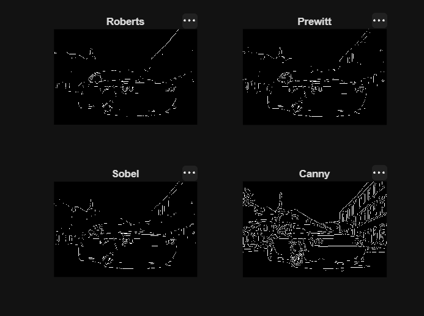

# Image Edge Detection Using MATLAB

A comparative study of different image edge detection techniques using MATLAB and the Image Processing Toolbox.

## 📌 Project Overview

Edge detection is an important technique in digital image processing and signal processing used to identify significant changes in image intensity. These changes often represent boundaries between different objects or regions in an image.

This project implements and compares four commonly used edge detection operators:

- Roberts
- Prewitt
- Sobel
- Canny

The input image is first converted from RGB to grayscale and smoothed using Gaussian filtering before applying the edge detection methods.

## 🎯 Objectives

- Convert a color image into grayscale.
- Reduce image noise using Gaussian filtering.
- Detect edges using different edge detection techniques.
- Compare the resulting edge maps.
- Study the differences in edge detection performance.

## 🛠️ Tools & Technologies

- MATLAB
- Image Processing Toolbox
- MATLAB Live Script (`.mlx`)

## 🔬 Methodology

The project follows these main steps:

1. Load the input image.
2. Convert the RGB image to grayscale.
3. Apply Gaussian filtering for noise reduction.
4. Apply Roberts edge detection.
5. Apply Prewitt edge detection.
6. Apply Sobel edge detection.
7. Apply Canny edge detection.
8. Compare the detected edges.

## 📊 Edge Detection Methods

### Roberts

The Roberts operator uses a small 2×2 kernel to detect rapid changes in intensity. It is simple and computationally efficient but can be more sensitive to noise.

### Prewitt

The Prewitt operator uses gradient masks to estimate changes in intensity in horizontal and vertical directions.

### Sobel

The Sobel operator is similar to Prewitt but gives greater weighting to the central pixels of the kernel, providing better smoothing and edge detection.

### Canny

The Canny detector is a multi-stage edge detection algorithm designed to produce accurate and well-defined edges while reducing the effect of noise.

## 🖼️ Input Image

The project uses the following test image:

`input_image.jpeg`

## 📈 Results

The original input image is processed using four different edge detection techniques: Roberts, Prewitt, Sobel and Canny.

### Input Image

### Edge Detection Comparison

The comparison demonstrates the differences in edge strength, continuity and noise sensitivity among the four methods.

## ▶️ How to Run

1. Download or clone this repository.
2. Open `Image_Edge_Detection.mlx` in MATLAB.
3. Make sure `input_image.jpeg` is in the same folder as the MATLAB Live Script.
4. Run the Live Script.

## 📁 Files

| File | Description |
|---|---|
| `Image_Edge_Detection.mlx` | MATLAB Live Script containing the complete implementation |
| `input_image.jpeg` | Input image used for edge detection |

## ✅ Conclusion

This project demonstrates how different edge detection techniques produce different representations of image boundaries. Roberts, Prewitt and Sobel provide gradient-based edge detection with varying sensitivity, while Canny generally produces more refined and continuous edges.

The comparison provides a practical understanding of edge detection as an application of digital image and signal processing.

---

### Author

**Jobis Bijo**

B.Tech Mechatronics Engineering
